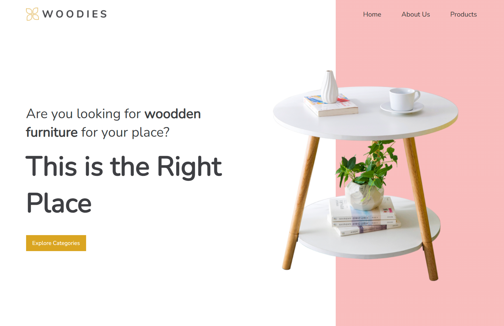
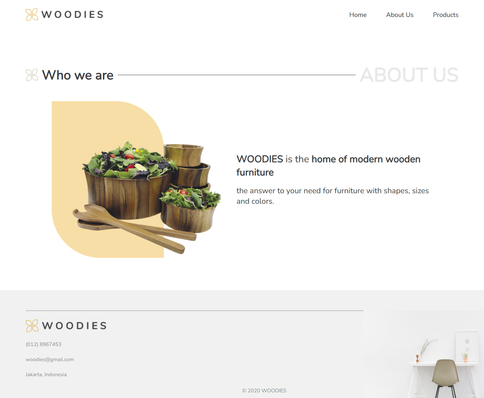
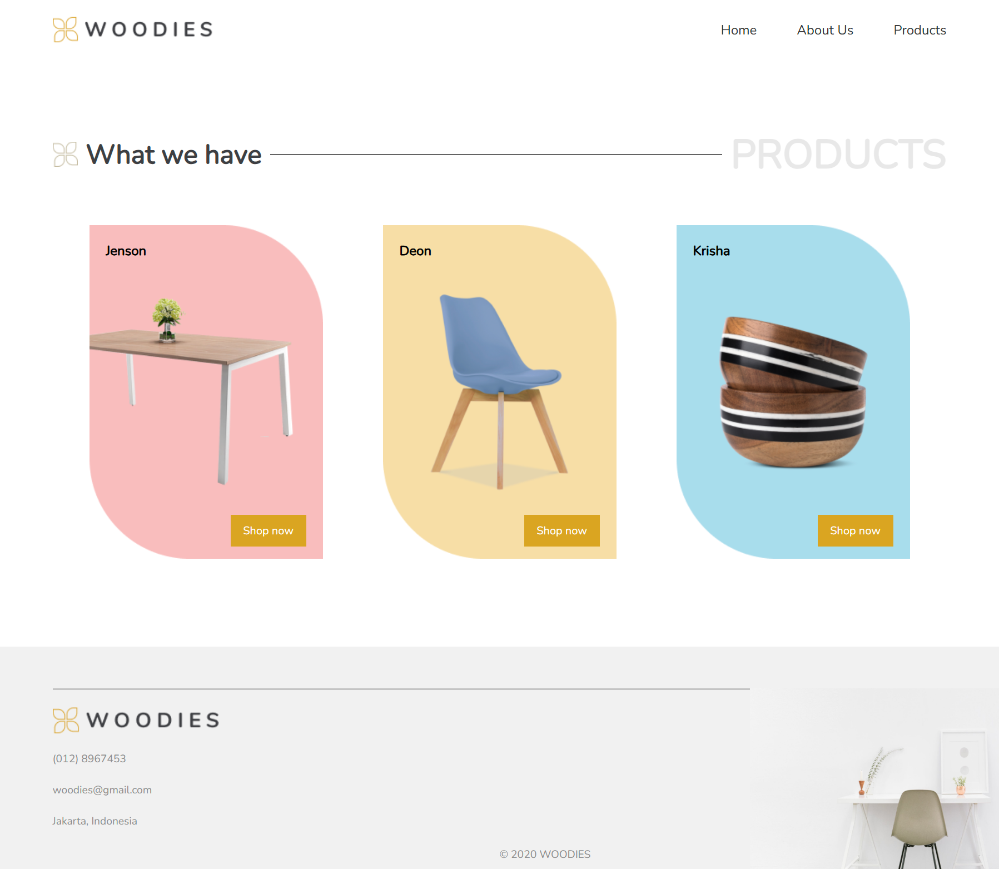

# 🪵 Projekt: Woodies – React Router Website

Diese Webanwendung stellt eine fiktive Möbelmarke vor, inklusive Produktseiten, Informationen zur Marke und dynamischem Routing. Sie wurde im Rahmen einer Frontend-Ausbildung mit **React**, **TypeScript** und **Vite** umgesetzt.

🔗 **Live-Demo**: [tinabk-project-react-woodies.netlify.app](https://tinabk-project-react-woodies.netlify.app/)  

## 🧰 Verwendete Technologien & Tools

- ⚛️ **React** – komponentenbasiertes JavaScript-Framework für die Benutzeroberfläche.
- 🟦 **TypeScript** – typisierte Superset von JavaScript für bessere Codequalität.
- ⚡ **Vite** – schneller Build- und Entwicklungsserver.
- 🌐 **React Router DOM** – für clientseitiges Routing und Navigation.
- 🎨 **CSS3** – für Layout, Responsive Design und Seitenstile.
- 🗂️ **Komponentenstruktur** – Header, Footer, Layout & Pages.
- 🖋️ **Google Fonts** – modernes und einheitliches Schriftbild.
- 🧠 **Modulare Seitenstruktur** – jede Seite besitzt ein eigenes Stylesheet.
- 🛠️ **VS Code**, **Git** & **GitHub** – als Entwicklungsumgebung und zur Versionskontrolle.

## 🔧 Funktionen

### 🏠 Startseite
- Begrüßung mit Titeltext, Bild und einem Handlungsaufruf.
- Dynamischer Hintergrund des Headers nur auf dieser Seite.

### ℹ️ Über uns
- Statische Seite mit Informationen über die Möbelmarke.

### 🛒 Produktübersicht
- Seite mit Produkten inklusive Bildern, Namen und einem Button zur Detailansicht.

### 📄 Produktdetailseite
- Detailansicht für das Produkt „Jenson Chair“ mit Informationen und Foto.

### ❌ Fehlerseite (404)
- Wird angezeigt, wenn eine nicht existierende Route eingegeben wird.

### 🔗 Navigation & Layout
- Navigationsmenü mit **NavLink**, das die aktuelle Seite markiert.
- **Header** auf jeder Seite sichtbar.
- **Footer** nur außerhalb der Startseite sichtbar.

## Kontaktinformationen

Falls Sie Fragen oder Vorschläge haben, können Sie mich kontaktieren:
- **E-Mail**: barshchevskak@gmail.com
- **GitHub**: [TinaBK24](https://github.com/TinaBK24)

## 📸 Screenshots

### 🔻 Startseite

### 🔻 About-Seite

### 🔻 Produkteseite

